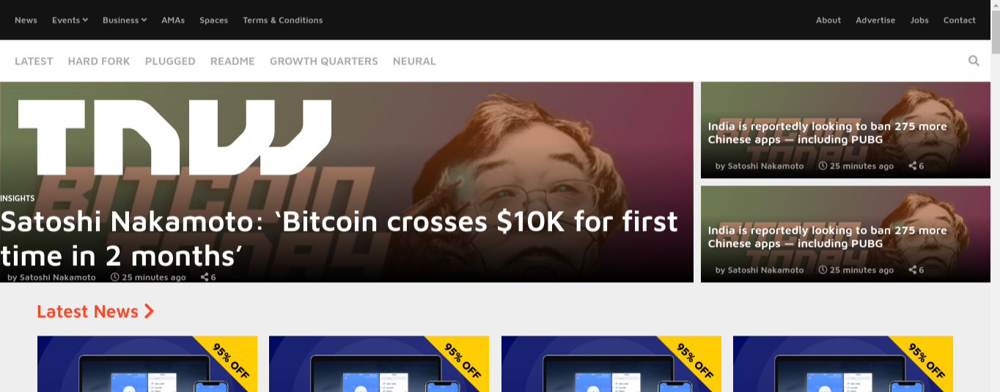

# Responsive Design

> In this project we created a clone of The Next Web webpage.

## Built With

- HTML
- CSS
- VSCode

## Live Demo

[Live Demo Link](https://raw.githack.com/gurbuzertunga/responsivedesign/feature/index.html)

## Authors

👤 **Akintoye Olamide**

- Github: [@AkintoyeOlamide](https://github.com/AkintoyeOlamide)
- Linkedin: [Akintoye Olamide](https://www.linkedin.com/in/Akintoye Olamide/)

👤 **Coding Parter**

- Github: [gurbuzertunga](https://github.com/gurbuzertunga)
- Linkedin: [gurbuzertunga](https://www.linkedin.com/in/gurbuz-ertunga-a607a2a5)

## 🤝 Contributing

Contributions, issues and feature requests are welcome!

Feel free to check the [issues page](enter issues url here).

## Show your support

Give a ⭐️ if you like this project!

## 📝 License

This project is [MIT](lic.url) licensed.